<div align="center">

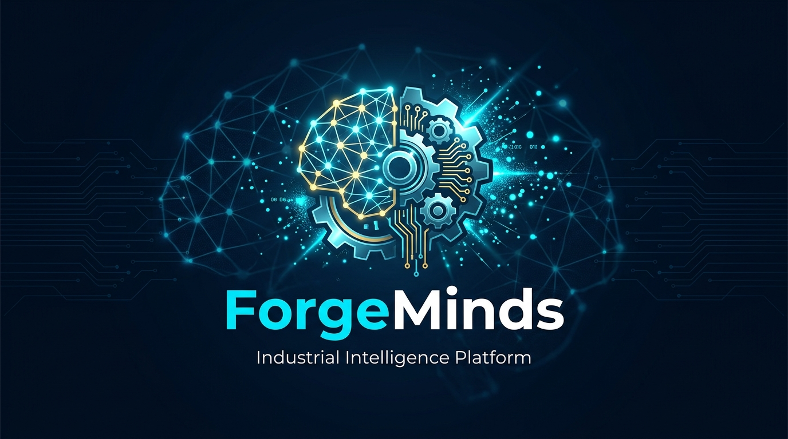

# 🧠 ForgeMinds

### **Industrial Intelligence Platform**

*Transforming industrial documentation into actionable intelligence through AI-powered document processing, knowledge graphs, and multi-agent systems.*

[](https://github.com/Shashank696/ForgeMinds/releases/tag/v1.0.0-hackathon)
[](https://python.org)
[](https://react.dev)
[](https://fastapi.tiangolo.com)
[](LICENSE)

[**Live Demo**](#-deployment) · [**Documentation**](#-api-overview) · [**Architecture**](#-system-architecture) · [**Getting Started**](#-installation)

</div>

---

## 📋 Table of Contents

- [Problem Statement](#-problem-statement)
- [Solution](#-our-solution)
- [Key Features](#-key-features)
- [System Architecture](#-system-architecture)
- [AI Pipeline](#-ai-pipeline)
- [Knowledge Graph Pipeline](#-knowledge-graph-pipeline)
- [Screenshots](#-screenshots)
- [Technology Stack](#-technology-stack)
- [Installation](#-installation)
- [API Overview](#-api-overview)
- [Database Architecture](#-database-architecture)
- [Folder Structure](#-folder-structure)
- [Demo Scenarios](#-demo-scenarios)
- [Team](#-team)
- [Future Scope](#-future-scope)
- [License](#-license)
- [Acknowledgements](#-acknowledgements)

---

## 🎯 Problem Statement

**Industrial operations generate massive volumes of documentation** — inspection reports, maintenance logs, compliance records, equipment manuals, work orders, and failure analyses. These documents contain critical knowledge that is:

- 📄 **Trapped in unstructured formats** (PDFs, scanned images, spreadsheets)
- 🔍 **Impossible to search** across thousands of documents efficiently
- 🧩 **Disconnected** — relationships between equipment, failures, regulations, and personnel are invisible
- ⏰ **Time-consuming** to analyze manually for compliance gaps or maintenance patterns
- 📉 **Underutilized** — valuable lessons learned are buried and repeated failures occur

> **The cost:** Unplanned downtime costs industrial companies an average of **$260,000 per hour**. 70% of compliance violations stem from documentation gaps. Critical maintenance insights are lost across organizational silos.

---

## 💡 Our Solution

**ForgeMinds** is an end-to-end Industrial Intelligence Platform that automatically:

1. **Ingests** industrial documents (PDFs, images, spreadsheets, text) via advanced OCR
2. **Extracts** entities — equipment tags, regulations, dates, personnel, failure modes
3. **Builds** a Knowledge Graph connecting all extracted entities and their relationships
4. **Enables** intelligent querying through a Multi-Agent RAG (Retrieval-Augmented Generation) system
5. **Predicts** equipment failures and recommends maintenance actions
6. **Assesses** regulatory compliance and identifies gaps with evidence packaging
7. **Visualizes** everything through a premium, interactive dashboard

<div align="center">
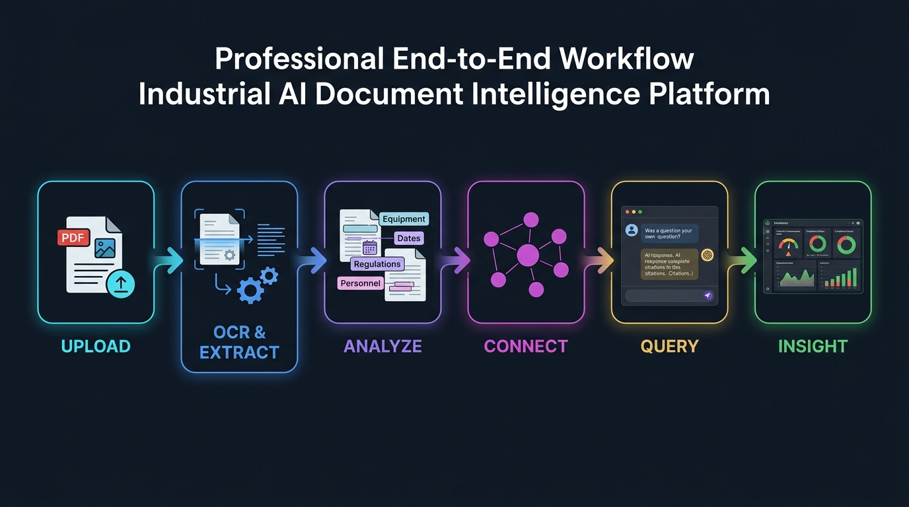
<br/><em>End-to-End Document Intelligence Workflow</em>
</div>

---

## ✨ Key Features

<table>
<tr>
<td width="50%">

### 📄 Document Intelligence
- Multi-format OCR (PDF, images, DOCX, spreadsheets)
- Automatic text extraction with pdfplumber + Tesseract
- Smart document chunking with overlap
- Real-time processing status tracking

### 🧠 Multi-Agent AI System
- Intent-aware query routing
- 4 specialized AI agents (Maintenance, Compliance, RCA, Lessons Learned)
- RAG pipeline with citation-backed responses
- Confidence scoring for every response

### 🔗 Knowledge Graph
- Automatic entity extraction (equipment, regulations, dates, personnel, failure modes)
- Neo4j-powered graph with MERGE deduplication
- Interactive force-directed visualization
- Subgraph exploration and filtering

</td>
<td width="50%">

### 🔧 Predictive Maintenance
- Equipment failure prediction with confidence scores
- Root Cause Analysis (RCA) engine
- Historical pattern correlation
- Proactive maintenance alerts

### 📋 Compliance Intelligence
- Multi-regulation compliance assessment
- Gap detection with severity scoring
- Evidence package generation
- Regulatory heatmap visualization

### 🔍 Hybrid Search
- Vector similarity search (Qdrant)
- Knowledge Graph traversal (Neo4j)
- Keyword search (PostgreSQL)
- Unified ranking with relevance scoring

</td>
</tr>
</table>

---

## 🏗 System Architecture

<div align="center">
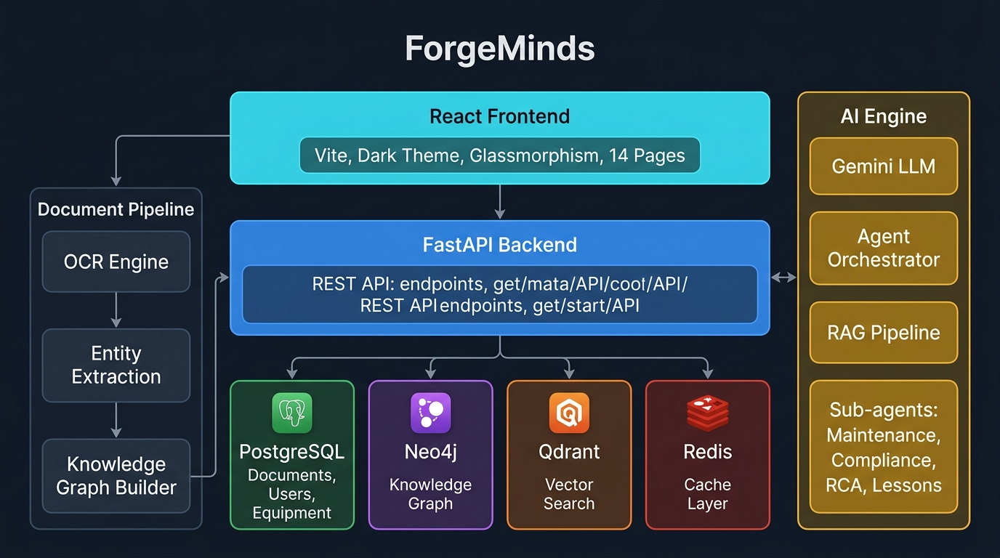
<br/><em>ForgeMinds System Architecture</em>
</div>

### Architecture Highlights

| Layer | Technology | Purpose |
|-------|-----------|---------|
| **Frontend** | React 18 + Vite | Premium dark-themed SPA with 14 interactive pages |
| **API Gateway** | FastAPI | Async REST API with JWT authentication |
| **AI Engine** | Gemini API + sentence-transformers | LLM reasoning + local vector embeddings |
| **Document Processing** | pdfplumber + Tesseract | Multi-format OCR and text extraction |
| **Graph Database** | Neo4j | Entity relationships and knowledge graph |
| **Vector Store** | Qdrant | Semantic search with 384-dim embeddings |
| **Relational DB** | PostgreSQL | Documents, users, equipment, audit logs |
| **Cache** | Redis | Session caching and rate limiting |

---

## 🤖 AI Pipeline

<div align="center">
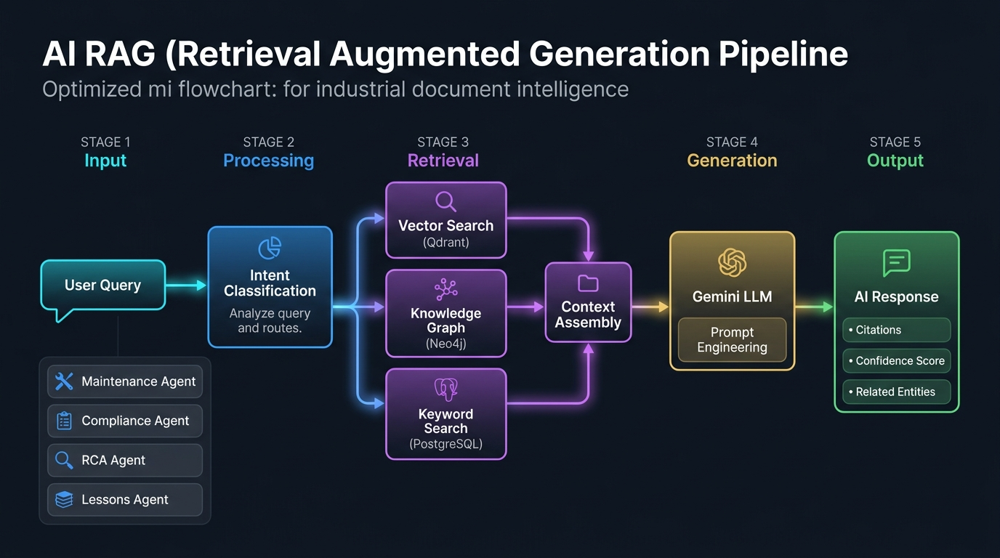
<br/><em>Multi-Agent RAG Pipeline</em>
</div>

### How It Works

```
User Query → Intent Classification → Agent Routing
                                        │
                    ┌───────────────────┼───────────────────┐
                    ▼                   ▼                   ▼
            🔧 Maintenance      📋 Compliance        🔍 RCA Agent
               Agent                Agent
                    │                   │                   │
                    └───────────────────┼───────────────────┘
                                        ▼
                              Context Retrieval
                    ┌───────────┬───────┴───────┐
                    ▼           ▼               ▼
              Vector Search  Graph Query   Keyword Search
                (Qdrant)      (Neo4j)     (PostgreSQL)
                    │           │               │
                    └───────────┴───────────────┘
                                ▼
                        Gemini LLM Generation
                                ▼
                    Response + Citations + Confidence
```

### Agent Specializations

| Agent | Capability | Example Query |
|-------|-----------|---------------|
| 🔧 **Maintenance** | Failure prediction, recommendations | *"What maintenance is needed for Pump P-101?"* |
| 📋 **Compliance** | Gap detection, evidence packaging | *"Are we compliant with ASME B31.3?"* |
| 🔍 **RCA** | Root cause analysis, incident correlation | *"What caused the bearing failure on C-300?"* |
| 📚 **Lessons** | Pattern detection, warnings | *"What lessons can we learn from past HX failures?"* |

---

## 🔗 Knowledge Graph Pipeline

<div align="center">
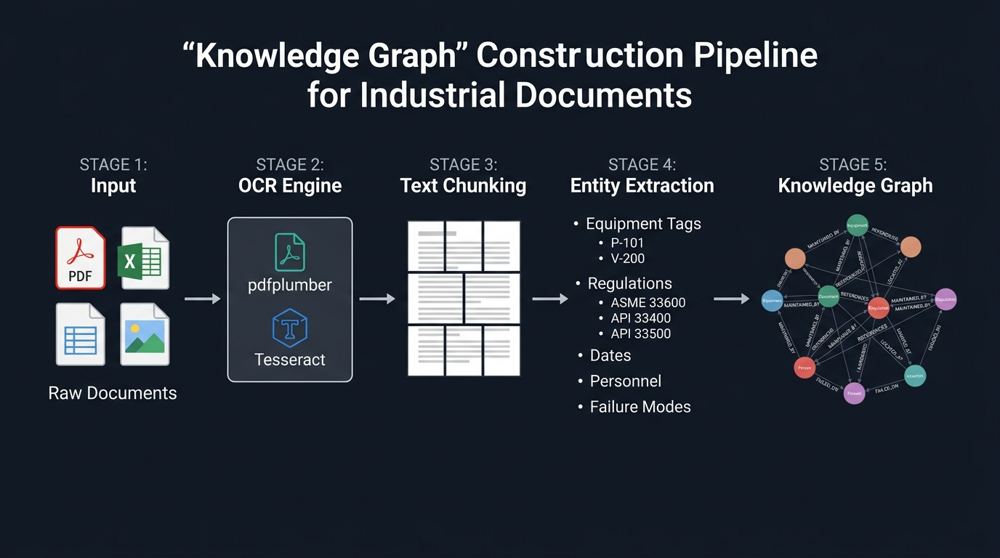
<br/><em>Knowledge Graph Construction Pipeline</em>
</div>

### Entity Types Extracted

| Entity Type | Examples | Color |
|------------|---------|-------|
| **Equipment** | P-101, V-200, C-300, HX-150 | 🔵 Cyan |
| **Regulation** | ASME B31.3, API 510, OSHA 29 CFR | 🟡 Gold |
| **Personnel** | Operators, inspectors, engineers | 🟢 Green |
| **Date** | Inspection dates, maintenance windows | 🟣 Purple |
| **Failure Mode** | Corrosion, vibration, fatigue, leak | 🔴 Red |
| **Location** | Plant areas, units, facilities | ⚪ White |

### Relationship Types

`MAINTAINED_BY` · `REFERENCES` · `LOCATED_AT` · `FAILED_ON` · `INSPECTED_BY` · `COMPLIANT_WITH` · `MENTIONS` · `RELATED_TO`

---

## 📸 Screenshots

<div align="center">

### Dashboard
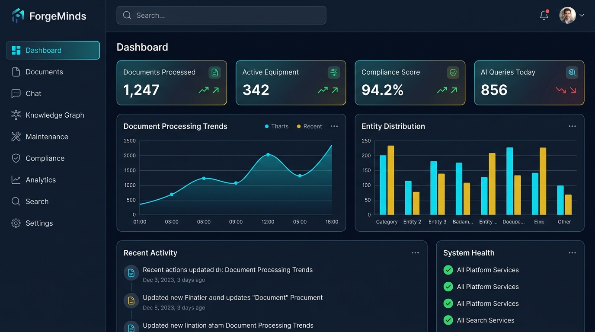
<br/><em>Real-time overview with stat cards, charts, and system health monitoring</em>

<br/>

### AI Chat Interface
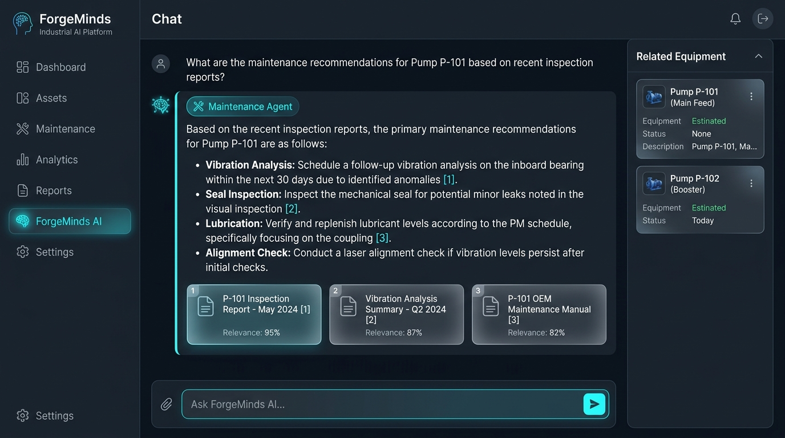
<br/><em>Multi-agent AI chat with citation-backed responses and confidence scoring</em>

<br/>

### Knowledge Graph Explorer
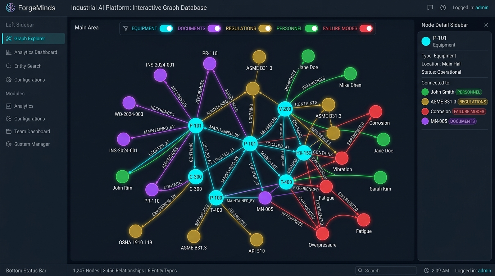
<br/><em>Interactive force-directed graph visualization with entity filtering</em>

<br/>

### Predictive Maintenance
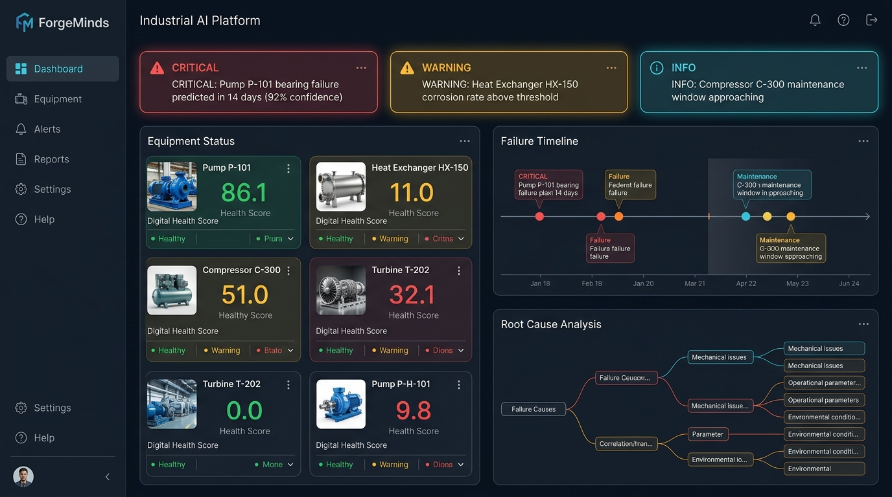
<br/><em>Equipment health monitoring, failure predictions, and RCA analysis</em>

<br/>

### Compliance Intelligence
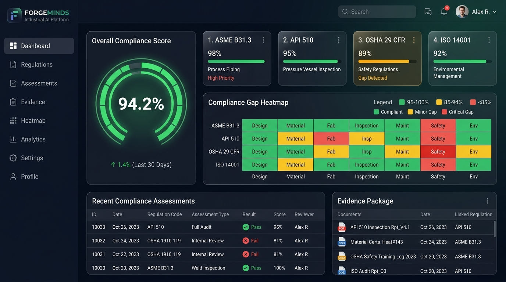
<br/><em>Multi-regulation compliance dashboard with gap heatmap and evidence packages</em>

</div>

---

## 🛠 Technology Stack

<div align="center">

| Category | Technologies |
|----------|-------------|
| **Frontend** |     |
| **Backend** |    |
| **AI/ML** |   |
| **Databases** |     |
| **OCR** |   |
| **Auth** |   |
| **DevOps** |   |

</div>

---

## 🚀 Installation

### Prerequisites

- **Python** 3.11+
- **Node.js** 18+
- **Docker** & Docker Compose (for databases)
- **Tesseract OCR** ([Installation Guide](https://github.com/tesseract-ocr/tesseract))

### Quick Start

```bash
# Clone the repository
git clone https://github.com/Shashank696/ForgeMinds.git
cd ForgeMinds

# Copy environment configuration
cp .env.example .env
# Edit .env with your configuration (see Environment Variables below)
```

### 🐳 Docker Setup (Recommended)

```bash
# Start all services (PostgreSQL, Neo4j, Qdrant, Redis, API, Frontend)
docker compose up -d

# Verify all services are running
docker compose ps

# Access the application
# Frontend:  http://localhost:5173
# Backend:   http://localhost:8000
# API Docs:  http://localhost:8000/docs
# Neo4j:     http://localhost:7474
```

### 💻 Local Development Setup

```bash
# Backend
cd backend
python -m venv venv
source venv/bin/activate  # Windows: venv\Scripts\activate
pip install -r requirements.txt
uvicorn backend.main:app --reload --host 0.0.0.0 --port 8000

# Frontend (new terminal)
cd frontend
npm install
npm run dev
```

### 🔑 Environment Variables

| Variable | Description | Default |
|----------|-------------|---------|
| `POSTGRES_HOST` | PostgreSQL host | `localhost` |
| `POSTGRES_PORT` | PostgreSQL port | `5432` |
| `POSTGRES_DB` | Database name | `forgeminds` |
| `NEO4J_URI` | Neo4j connection URI | `bolt://localhost:7687` |
| `NEO4J_PASSWORD` | Neo4j password | `forgeminds_dev` |
| `QDRANT_HOST` | Qdrant vector DB host | `localhost` |
| `REDIS_HOST` | Redis cache host | `localhost` |
| `GEMINI_API_KEY` | Google Gemini API key ([Get free key](https://aistudio.google.com/apikey)) | — |
| `JWT_SECRET_KEY` | JWT signing secret | — |
| `CORS_ORIGINS` | Allowed CORS origins | `http://localhost:5173` |

---

## 📡 API Overview

ForgeMinds exposes a comprehensive REST API. Full interactive documentation is available at `/docs` (Swagger UI) and `/redoc` (ReDoc).

### Core Endpoints

| Method | Endpoint | Description |
|--------|----------|-------------|
| `POST` | `/api/auth/register` | Register a new user |
| `POST` | `/api/auth/login` | Authenticate and receive JWT token |
| `GET` | `/api/auth/me` | Get current user profile |
| `POST` | `/api/documents/upload` | Upload and process a document |
| `GET` | `/api/documents` | List all documents with pagination |
| `GET` | `/api/documents/{id}` | Get document details with entities |
| `POST` | `/api/search` | Hybrid search across all documents |
| `POST` | `/api/chat` | Send a query to the AI agent system |
| `GET` | `/api/chat/history/{session}` | Get chat history for a session |
| `GET` | `/api/knowledge-graph/nodes` | Query knowledge graph nodes |
| `GET` | `/api/knowledge-graph/subgraph/{id}` | Get entity subgraph |
| `GET` | `/api/maintenance/predictions` | Get failure predictions |
| `POST` | `/api/maintenance/rca` | Run root cause analysis |
| `GET` | `/api/compliance/status` | Get compliance overview |
| `GET` | `/api/compliance/gaps` | Detect compliance gaps |
| `GET` | `/api/analytics/overview` | Dashboard analytics |
| `GET` | `/api/equipment` | List all equipment |
| `GET` | `/api/health` | Health check |

---

## 🗄 Database Architecture

<div align="center">
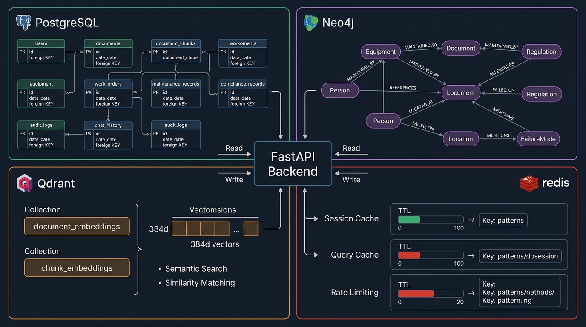
<br/><em>Multi-Database Architecture</em>
</div>

### PostgreSQL Schema (Relational)

```
users ─────────────┐
documents ─────────┤──── document_chunks
equipment ─────────┤──── maintenance_records
work_orders ───────┤──── compliance_records
chat_history ──────┤
audit_logs ────────┤
search_history ────┘
```

### Neo4j Schema (Graph)

```
(:Equipment)-[:MAINTAINED_BY]->(:Person)
(:Document)-[:MENTIONS]->(:Equipment)
(:Equipment)-[:COMPLIANT_WITH]->(:Regulation)
(:Equipment)-[:FAILED_ON]->(:FailureMode)
(:Document)-[:REFERENCES]->(:Regulation)
```

### Qdrant Collections (Vector)

| Collection | Dimensions | Purpose |
|-----------|-----------|---------|
| `document_embeddings` | 384 | Full document similarity search |
| `chunk_embeddings` | 384 | Fine-grained passage retrieval |

---

## 📁 Folder Structure

```
ForgeMinds/
├── 📂 backend/                    # FastAPI Backend
│   ├── 📂 api/                    # REST API endpoints
│   │   ├── auth.py                # Authentication routes
│   │   ├── documents.py           # Document management
│   │   ├── search.py              # Hybrid search
│   │   ├── chat.py                # AI chat interface
│   │   ├── knowledge_graph.py     # Knowledge graph queries
│   │   ├── maintenance.py         # Predictive maintenance
│   │   ├── compliance.py          # Compliance intelligence
│   │   ├── analytics.py           # Dashboard analytics
│   │   └── equipment.py           # Equipment management
│   ├── 📂 services/               # Business logic layer
│   │   ├── auth_service.py        # JWT/bcrypt authentication
│   │   ├── document_service.py    # Document CRUD operations
│   │   ├── ingestion_service.py   # Document processing pipeline
│   │   ├── ocr_service.py         # Multi-format OCR engine
│   │   ├── entity_extraction.py   # NER for industrial entities
│   │   ├── knowledge_graph_service.py  # Neo4j graph operations
│   │   ├── embedding_service.py   # Vector embedding generation
│   │   ├── search_service.py      # Hybrid search engine
│   │   ├── rag_service.py         # RAG pipeline with citations
│   │   ├── agent_orchestrator.py  # Multi-agent routing
│   │   ├── maintenance_agent.py   # Predictive maintenance AI
│   │   ├── compliance_agent.py    # Compliance assessment AI
│   │   ├── rca_agent.py           # Root cause analysis AI
│   │   └── lessons_agent.py       # Lessons learned AI
│   ├── 📂 db/                     # Database clients
│   │   ├── database.py            # PostgreSQL async client
│   │   ├── neo4j_client.py        # Neo4j driver wrapper
│   │   ├── qdrant_client.py       # Qdrant vector client
│   │   └── redis_client.py        # Redis cache client
│   ├── 📂 utils/                  # Utilities
│   ├── config.py                  # Pydantic settings
│   └── main.py                    # FastAPI app entry point
├── 📂 frontend/                   # React Frontend
│   └── 📂 src/
│       ├── 📂 components/         # Reusable UI components
│       ├── 📂 pages/              # 14 application pages
│       ├── 📂 hooks/              # Custom React hooks
│       ├── 📂 context/            # Auth & Theme providers
│       ├── 📂 services/           # API client & mock data
│       └── 📂 utils/              # Formatters & constants
├── 📂 shared/                     # Shared interfaces & enums
├── 📂 tests/                      # Test suite (47 tests)
├── 📂 data/                       # Sample industrial documents
├── 📂 docs/                       # Documentation & diagrams
├── 📂 scripts/                    # Utility scripts
├── docker-compose.yml             # Multi-service orchestration
├── .env.example                   # Environment template
└── README.md                      # This file
```

---

## 🎬 Demo Scenarios

### Demo 1: Document Intelligence Pipeline

```
Upload maintenance PDF → OCR extracts text → Entity extraction finds Equipment (P-101),
Regulation (API 510), Failure Mode (corrosion) → Knowledge Graph links entities →
Ask AI: "What maintenance does P-101 need?" → Get cited response with recommendations
```

### Demo 2: Predictive Maintenance

```
Navigate to Maintenance Dashboard → View equipment health scores →
Click on critical alert for Pump P-101 → See failure prediction (92% confidence, 14 days) →
Run RCA → See correlated past incidents → Get AI-generated maintenance plan
```

### Demo 3: Compliance Assessment

```
Navigate to Compliance Dashboard → See overall score (94.2%) →
View gap heatmap → Click ASME B31.3 gaps → Generate evidence package →
Download compliance report with linked source documents
```

### Demo 4: Knowledge Graph Exploration

```
Navigate to Knowledge Graph → Filter by Equipment type →
Click on node P-101 → Explore subgraph (depth=2) →
See connected documents, regulations, personnel, failure modes →
Click on related regulation to see all affected equipment
```

### Demo 5: Hybrid AI Search

```
Search: "bearing failures in pumps last 6 months" →
Get hybrid results (vector + graph + keyword) →
See relevance-ranked documents with highlights →
Click result to see full document with extracted entities
```

---

## 👥 Team

<div align="center">

| Member | Role | Responsibility |
|--------|------|---------------|
| **SP** | 🏗️ Chief Architect & Technical Lead | Architecture, Integration, Auth, Analytics, Testing, Documentation |
| **Rudra** | 📄 Document Intelligence Engineer | OCR, Entity Extraction, Knowledge Graph, Ingestion Pipeline |
| **Harsh** | 🤖 AI Engine Developer | RAG, Multi-Agent System, Embeddings, Search, LLM Integration |
| **Dil** | 🎨 Frontend Developer | React UI, Dark Theme, Components, Pages, Responsive Design |

</div>

---

## 🔮 Future Scope

- **Real-time Document Streaming** — Process documents as they arrive via message queues
- **Multi-language OCR** — Support for documents in multiple languages
- **Custom Model Fine-tuning** — Fine-tune embeddings on domain-specific industrial text
- **Mobile Application** — React Native companion app for field inspectors
- **IoT Integration** — Connect with SCADA/PLC systems for real-time equipment data
- **Advanced RCA** — Bayesian network-based root cause analysis
- **Digital Twin** — Equipment digital twin powered by knowledge graph
- **Automated Report Generation** — AI-generated compliance and maintenance reports
- **Role-based Access Control** — Granular permissions for different user roles
- **Audit Trail** — Complete activity logging for regulatory compliance

---

## 📄 License

This project is licensed under the **MIT License** — see the [LICENSE](LICENSE) file for details.

---

## 🙏 Acknowledgements

- [Google Gemini](https://ai.google.dev/) — LLM and embedding capabilities
- [FastAPI](https://fastapi.tiangolo.com/) — Modern async Python web framework
- [Neo4j](https://neo4j.com/) — Graph database for knowledge representation
- [Qdrant](https://qdrant.tech/) — Vector similarity search engine
- [sentence-transformers](https://www.sbert.net/) — Local embedding generation
- [pdfplumber](https://github.com/jsvine/pdfplumber) — PDF text extraction
- [Tesseract OCR](https://github.com/tesseract-ocr/tesseract) — Optical character recognition
- [React Force Graph](https://github.com/vasturiano/react-force-graph) — Graph visualization
- [Recharts](https://recharts.org/) — React charting library

---

<div align="center">

**Built with ❤️ by Team ForgeMinds**

*ETAI Hackathon 2026*

<br/>

[](https://github.com/Shashank696/ForgeMinds)

</div>
